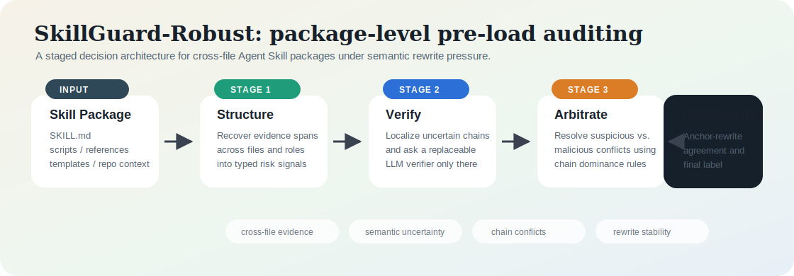
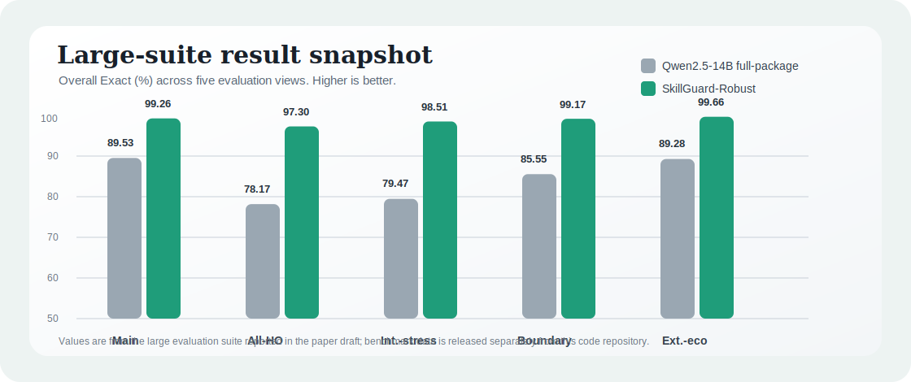

# SkillRobust

Code release for **SkillRobust**, a package-level robust auditing framework for untrusted Agent Skill packages.

Modern agent systems increasingly load reusable "skills" before execution. A skill is not just a prompt: it can contain `SKILL.md`, scripts, reference documents, templates, and repository context. This makes pre-load safety auditing a package-level decision problem. A flat guardrail can miss cross-file evidence, or collapse malicious behavior into a weaker suspicious label after semantic rewrites.

SkillRobust studies this problem and provides a reusable implementation of a staged auditing pipeline for classifying skill packages as `benign`, `suspicious`, or `malicious`.

<p align="center">
  
</p>

## Paper Overview

The paper introduces:

- **Skill package auditing** as a cross-file, pre-load security review problem for agent skills.
- **SkillGuard-Bench**, a benchmark of benign, suspicious, malicious, and rewrite-stressed skill packages.
- **SkillGuard-Robust**, an error-decomposition induced auditing architecture.
- A diagnostic finding that strong single-shot judges often detect risk but fail to preserve the operational distinction between suspicious and malicious packages.

The method is designed around four recurring failure modes:

- Cross-file evidence dispersion, where the decisive risk chain is split across `SKILL.md`, references, scripts, and repository context.
- Local semantic uncertainty, where a single span is ambiguous without nearby package evidence.
- Chain dominance ambiguity, where suspicious and malicious cues conflict.
- Rewrite instability, where semantic-preserving rewrites change the predicted label.

SkillRobust addresses these issues with structured evidence extraction, optional semantic verification, conflict-aware aggregation, and robust final consolidation.

<p align="center">
  
</p>

## What This Repository Contains

This repository is the **code-only release**. Benchmark data is distributed separately as a dataset release.

```text
.
|-- src/skillrobust/        # reusable auditing package and CLI
|-- docs/                   # usage guide
|-- tests/                  # lightweight local tests
|-- server/                 # optional vLLM serving helpers
|-- benchmark/schema/       # JSON schemas for package records and evidence bundles
|-- pyproject.toml
|-- requirements-experiments.txt
|-- .env.example
|-- .gitignore
`-- README.md
```

## Install

```bash
python -m pip install -e .
```

The core CLI uses only the Python standard library. Install optional experiment dependencies only if you want to run model-serving or reproduction workflows:

```bash
python -m pip install -r requirements-experiments.txt
```

## Quick Start

Audit one materialized skill package:

```bash
skillrobust audit-package /path/to/skill_package
```

Audit a JSONL benchmark split:

```bash
skillrobust audit-jsonl \
  --input /path/to/split.jsonl \
  --output outputs/audit.jsonl
```

Use an OpenAI-compatible verifier endpoint:

```bash
skillrobust audit-jsonl \
  --input /path/to/split.jsonl \
  --output outputs/audit.jsonl \
  --endpoint-url http://127.0.0.1:8000/v1 \
  --model qwen2_5_14b_instruct
```

If the endpoint requires authentication, set `SKILLROBUST_API_KEY` or pass `--api-key`.

## Input Format

For JSONL evaluation, each line should be a package record with:

- `sample_id`: unique package identifier.
- `skill.root_path`: package root path or logical package path.
- `skill.files`: list of package files, where each item has `path`, `role`, and `content`.
- optional `labels`: ground-truth labels for evaluation.

The separate dataset release follows this format and also includes materialized packages under `data/packages/`.

## Output Format

The auditor emits one JSON object per package:

- `prediction`: final `benign`, `suspicious`, or `malicious` decision.
- `confidence`: confidence score from the robust decision layer.
- `reason`: short explanation for the final decision.
- `structured_evidence`: deterministic evidence signals extracted from package files.
- `semantic_verification`: optional verifier result when an endpoint is configured.

## Safety Notice

Risk and rewrite samples used with this project may contain simulated or reconstructed unsafe patterns. They are intended for isolated security evaluation only. Do not install or execute untrusted benchmark packages as operational skills.

## Citation

If you use this code, benchmark, or paper in your research, please cite:

```bibtex
@article{li2026skillrobust,
  title        = {SkillRobust: Robust Pre-Load Auditing of Untrusted Agent Skill Packages},
  author       = {Li, Lijia and Others},
  journal      = {arXiv preprint},
  year         = {2026},
  note         = {arXiv identifier pending}
}
```

The arXiv identifier will be updated after the paper passes moderation.
